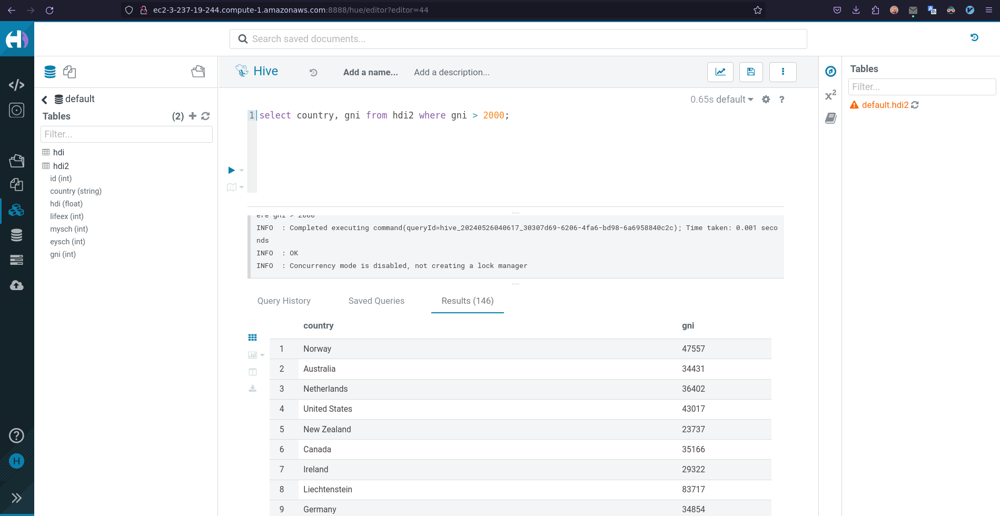
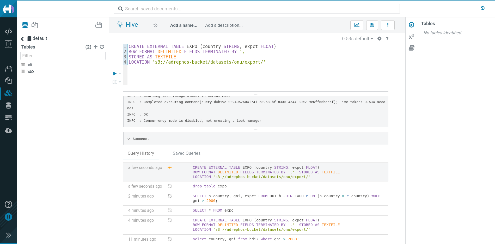

# ST0256 Tópicos Especiales en Telemática

## Estudiante:
- Nombre: Juan Esteban Avendaño Castaño
- Correo: jeavendanc@eafit.edu.co

## Profesor:
- Nombre: Álvaro Ospina
- Correo: aeospinas@eafit.edu.co

# Reto 6 -  Hive

## Cluster de Amazon EMR
Este es el cluster de Amazon EMR que se utilizó para el desarrollo del reto 6. El cluster fue creado con las indicaciones del
[Lab 0](https://github.com/st0263eafit/st0263-241/blob/main/bigdata/00-lab-aws-emr/Install-AWS-EMR.pdf):

## HIVE y SparkSQL, Gestión de datos via sql

### 1. Ingresar a Hue
Ingreso a la URL de Hue y creo el usuario `hadoop`:

Selecciono HIVE para empezar a trabajar con la base de datos:

### 2. Tabla en HIVE (/user/hive/warehouse)
#### Crear tabla
Creamos la tabla de la siguiente manera:

#### Subir datos
Subimos el archivo `hdi-data.csv` a la tabla en la ruta `/user/hive/warehouse/hdi`:

#### Consultas
Podemos por ejemplo listar la información de la tabla con la consulta `SELECT * FROM hdi;`:

### 3. Tabla en S3 (s3://adrephos-bucket)
#### Crear tabla
Creamos la tabla de la siguiente manera:

#### Subir datos
Como los datos ya están en S3, no es necesario subirlos. Solo se crea la tabla y se hace la consulta:

#### Consultas
Esta consulta trae las columnas `country` y `hdi` de la tabla `hdi2` de los paises
cuando el `hdi` es mayor a 2000:

### 3. Join de tablas
Primero creamos una tabla `expo` para hacer el join con la tabla `hdi`:

Luego hacemos el join de las tablas `hdi` y `expo`:

> [!TIP]  
> Con este join podemos ver como podemos operar entre tablas internas y externas en HIVE.

### 4. WordCount en HIVE
#### Crear tabla
Creamos una tabla `docs` en S3 con HIVE:

Y verificamos que la tabla se haya copiado correctamente:

#### Ordenar por palabras
Hacemos un `SELECT` de la tabla `docs` y ordenamos por palabras:

En esta se muestra la frecuencia de las palabras y se ordenan de forma descendente
en base al orden alfabético.

#### Ordenamos por frecuencia de palabras:
Hacemos un `SELECT` de la tabla `docs` y ordenamos por frecuencia de palabras:

En esta se muestran las 10 primeras palabras más frecuentes en la tabla `docs`.

### 5. Reto
¿Cómo llenar una tabla con los resultados de un Query? por ejemplo, como almacenar
en una tabla el diccionario de frecuencia de palabras en el wordcount?

1. Creamos una carpeta en S3 llamada `wordcount` para guardar los resultados
del wordcount:

2. Primero creamos una tabla `wordcount` con las columnas `word` y `count`:

3. Luego hacemos un `INSERT` en la tabla `wordcount` con los resultados del wordcount:

4. Verificamos que los datos se hayan insertado correctamente:

5. Subimos la tabla `wordcount` a S3 de la siguiente manera:

6. Verificamos que la tabla `wordcount` se haya subido correctamente:

## Conclusiones
- HIVE es una herramienta muy útil para trabajar con grandes cantidades de datos.
- HIVE permite trabajar con datos en S3 y HDFS.
- HIVE permite hacer joins entre tablas internas y externas.
- HIVE permite hacer consultas SQL para manipular los datos.
- HIVE permite guardar los resultados de un query en una tabla.
